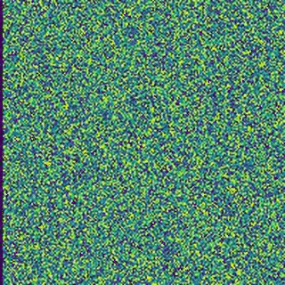
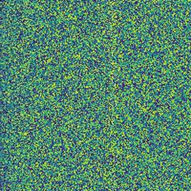
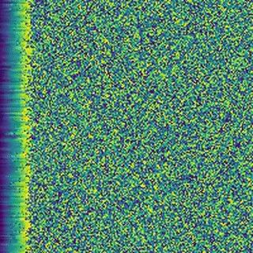
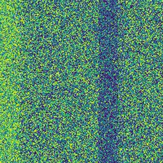
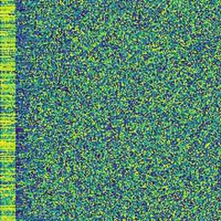

# AlgoVis
## Selection Sort

```python

def selectionSort(arr):
    for i in range(len(arr)):
        less = i
        for j in range(i,len(arr)-1):
            if arr[j+1] > arr[less]:
                less = j + 1
        if less != i:
             arr[i], arr[less] = arr[less], arr[i]
```

## Bubble Sort

```python
def bubblesort(arr):
    N = len(arr)
    for i in range(N):
        for x in range(0,N-i-1):
            if arr[x] < arr[x+1]:
                arr[x], arr[x+1] = arr[x+1], arr[x]
```

## Insertion Sort

```python
def insertionSort(arr):
    for i in range(len(arr)):
        key = arr[i]
        j = i
        while (j > 0 and key > arr[j-1]):
            if arr[j] > arr[j-1]:
                arr[j], arr[j-1] = arr[j-1], arr[j]
            j -= 1
```

## Shell Sort

```python
def shellSort(arr):
    N = len(arr)
    #setting h interval
    h = 1
    while(h < N/3): 
        h = h * 3 + 1 #increment sequence by 3x + 1 

    while (h > 0):
        for i in range(h, N):
            j = i
            while (j >= h and arr[j] < arr[j-h]):
                arr[j], arr[j-h] = arr[j-h], arr[j]
                j -= h
        h //= 3 #move to next increment
```
## Quick Sort

```python
def partition(arr, begin, end): 
    i = low - 1       
    pivot = arr[end]
    for j in range(begin, end): 
        if arr[j] < pivot: 
            i = i + 1 
            arr[i],arr[j] = arr[j],arr[i] 
    arr[i + 1],arr[end] = arr[end],arr[i + 1] 
    return i + 1 
 
def quickSort(arr, begin, end): 
    if begin < end:
        sep = partition(arr,begin,end)  
        quickSort(arr, low, sep - 1) 
        quickSort(arr, sep + 1, end) 
